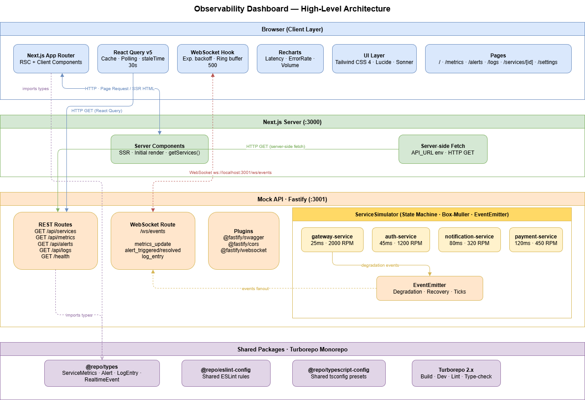

<p align="center">
  
</p>

<h1 align="center">Observability Dashboard</h1>

<p align="center">
  Real-time infrastructure monitoring platform — WebSocket-driven metrics, alerts, and logs for microservice fleets.
</p>

<p align="center">
  
  
  
  
  
</p>

---

A production-grade observability platform that monitors microservice health in real time. Built as a TypeScript monorepo, it combines a **Next.js 16 App Router** frontend with a **Fastify 5** backend that streams live metrics, alerts, and structured logs over a persistent WebSocket connection — no polling required, sub-second latency end-to-end.

The backend simulation engine uses **Box-Muller Gaussian distributions** to generate statistically realistic latency and error-rate telemetry, with autonomous degradation events that propagate from the simulator through WebSocket to the UI cache — all type-safe via a shared contract in `packages/types`.

## Architecture

<p align="center">
  
  <br />
  <em>Web app → REST + WebSocket → Mock API → ServiceSimulator</em>
</p>

## Features

- **Real-time WebSocket streaming** — metrics, alerts, and log events delivered with sub-second latency
- **Exponential backoff reconnection** — auto-reconnects from 1 s up to 30 s, with a maximum of 10 attempts and a 500-event ring buffer to prevent memory bloat
- **Typed discriminated union events** — six `RealtimeEvent` types narrowed at compile time across the entire monorepo
- **React Query cache surgery** — WebSocket events update query caches directly, eliminating redundant HTTP round-trips after the initial fetch
- **Interactive time-series charts** — latency (avg / p95 / p99), error rate, and request throughput via Recharts
- **Alert lifecycle management** — critical, warning, and info severities with triggered/resolved state and toast notifications
- **Live log feed** — filterable by service and level (error / warn / info / debug)
- **Per-service drill-down** — dedicated page with full historical metrics for each monitored service
- **OpenAPI 3.0 + Swagger UI** — always-in-sync API documentation at `/docs`, generated from schema-first route definitions
- **Light / dark / system themes** — adaptive UI with localStorage persistence

## Tech Stack

| Layer | Technology |
|---|---|
| Frontend framework | Next.js 16 (App Router + RSC) |
| UI | React 19, Tailwind CSS 4, Lucide React |
| Server state | TanStack React Query 5 |
| Charts | Recharts 3 |
| Notifications | Sonner |
| Theming | next-themes |
| Real-time transport | WebSocket (native API) |
| Backend framework | Fastify 5 |
| API documentation | @fastify/swagger + @fastify/swagger-ui (OpenAPI 3.0) |
| Runtime validation | Zod 4 |
| Shared domain types | `@repo/types` (`packages/types`) |
| Language | TypeScript 5.9 (strict mode) |
| Monorepo orchestration | Turborepo 2 |
| Package manager | npm workspaces |

## Monorepo Structure

```
observability-dashboard/
├── apps/
│   ├── web/                  # Next.js 16 frontend
│   │   ├── app/              # App Router pages (overview, metrics, alerts, logs, settings)
│   │   ├── components/       # Dashboard widgets, charts, layout shell
│   │   ├── hooks/            # use-websocket, use-services, use-metrics, use-alerts, use-logs
│   │   └── lib/api.ts        # Typed fetch wrapper
│   └── mock-api/             # Fastify 5 backend + WebSocket server
│       └── src/
│           ├── simulator.ts  # ServiceSimulator — Gaussian noise + degradation lifecycle
│           ├── routes/       # REST handlers, WebSocket fanout, health check
│           └── schemas.ts    # JSON Schema definitions (source of truth for OpenAPI)
├── packages/
│   ├── types/                # Shared domain types — ServiceMetrics, Alert, LogEntry, RealtimeEvent
│   ├── eslint-config/        # Shared ESLint configs (base, next-js, react-internal)
│   └── typescript-config/    # Shared tsconfig bases
├── docs/
│   └── assets/               # Architecture diagram and screenshots
└── turbo.json                # Task pipeline (build → check-types → lint → dev)
```

## Getting Started

**Prerequisites:** Node.js ≥ 20, npm ≥ 10

```bash
git clone https://github.com/lucas95santos/observability-dashboard.git
cd observability-dashboard
npm install
npm run dev
```

Turborepo boots the full stack in a single command:

| Service | URL |
|---|---|
| Web app | http://localhost:3000 |
| Mock API | http://localhost:3001 |
| Swagger UI | http://localhost:3001/docs |

> [!NOTE]
> No external infrastructure required. The mock API simulates four microservices (Payment, Auth, Notification, Gateway) with realistic Gaussian noise and autonomous degradation events; everything runs entirely in process.

### Environment variables

Create `apps/web/.env.local` to override the defaults:

| Variable | Default | Description |
|---|---|---|
| `NEXT_PUBLIC_API_URL` | `http://localhost:3001` | REST API base URL |
| `NEXT_PUBLIC_WS_URL` | `ws://localhost:3001` | WebSocket server URL |

## Scripts

Run these from the monorepo root — Turborepo handles dependency ordering and incremental caching automatically.

```bash
npm run dev          # Start web + mock-api concurrently (persistent, cache-disabled)
npm run build        # Production build for all apps (cached)
npm run check-types  # TypeScript check across the entire monorepo
npm run lint         # ESLint across all apps and packages
npm run format       # Prettier on all .ts, .tsx, and .md files
```

## Architecture & Design Decisions

**Monorepo with Turborepo task pipeline** — all apps and packages share a single `npm install`, a unified lint/type-check/build pipeline, and remote-cache-ready incremental outputs. The `build` task enforces `^build` ordering so shared packages always compile before consumers; `dev` is persistent and cache-disabled to enable hot reload. The trade-off is a steeper initial setup, but CI cost stays flat as the repo grows.

**WebSocket with exponential backoff and a ring buffer** — `use-websocket.ts` owns the entire connection lifecycle: it reconnects automatically (initial delay 1 s, doubles up to 30 s cap, max 10 attempts) and keeps the last 500 events in a circular buffer to guard against unbounded memory growth. Polling was the obvious alternative, but would trade away the sub-second latency that makes a monitoring dashboard useful under incident conditions.

**React Query cache surgery via WebSocket events** — every app-level hook (`use-services`, `use-metrics`, `use-logs`, `use-alerts`) ships a paired cache-updater that subscribes to `RealtimeEvent` and writes directly into the query cache with `queryClient.setQueryData`. This means the UI stays live without extra HTTP round-trips after the initial page load; React Query's stale-time and polling interval act only as a safety net for reconnection gaps.

**Shared type contract via `packages/types`** — `ServiceMetrics`, `Alert`, `LogEntry`, and the six-member `RealtimeEvent` discriminated union are declared once and consumed by both the frontend and the backend. A breaking change — renaming a field, adding a required property — fails `check-types` across the entire monorepo before any code reaches runtime. The cost is one extra package to maintain; the payoff is an API boundary that is verified at build time, not discovered in production.

**Gaussian noise simulation with autonomous degradation** — `ServiceSimulator` uses the Box-Muller transform to generate normally distributed latency and error-rate samples instead of uniform random noise, so time-series charts exhibit the bell-curve shape characteristic of real production traces. Every 30 seconds each service has a 20 % chance to enter a degraded state (latency multiplier 1.5×–7×, error rate 8–15 %, throughput −30 %) that auto-resolves after 10–20 s, firing `alert_triggered` / `alert_resolved` events that flow to all connected WebSocket clients in real time.

## App Documentation

| App | README | What's covered |
|---|---|---|
| Frontend (Next.js) | [apps/web/README.md](apps/web/README.md) | Pages, components, hooks, charts, env vars, screenshots |
| Mock API (Fastify) | [apps/mock-api/README.md](apps/mock-api/README.md) | REST endpoints, WebSocket events, ServiceSimulator internals, OpenAPI schema |

## License

MIT
