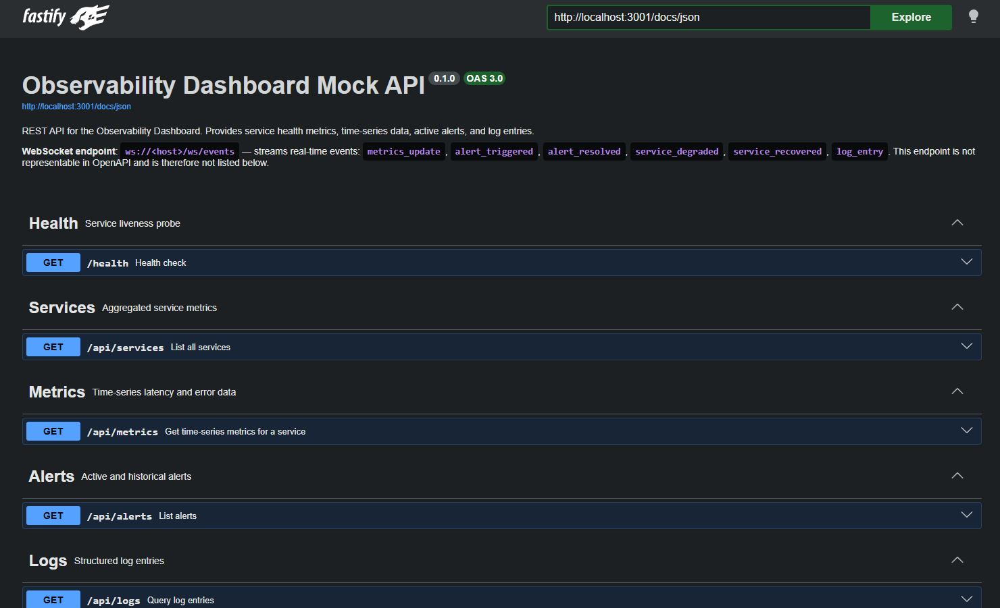

<h1 align="center">mock-api</h1>
<p align="center">Realistic observability data simulator — REST + WebSocket backend for the Observability Dashboard.</p>

<p align="center">
  
  
  
  
</p>

---

## Overview

`mock-api` is the backend companion for the [Observability Dashboard](../web). It exposes a REST API and a WebSocket endpoint that stream statistically realistic service telemetry — latency distributions, error rates, throughput, alerts, and structured logs — without requiring any real infrastructure.

The simulation engine models service behavior using **Box-Muller Gaussian distributions** instead of uniform random noise, producing latency and error rate data whose statistical shape matches production traces. Services enter and exit degraded states autonomously, triggering and resolving alerts that flow to connected clients in real time.

The full API surface is documented via **OpenAPI 3.0** and served interactively through Swagger UI at `/docs`.



## Features

- **Five REST endpoints** covering health, services, time-series metrics, alerts, and logs
- **Real-time WebSocket streaming** with six discriminated event types
- **Gaussian noise simulation** — Box-Muller transform for realistic latency/error distributions
- **Autonomous degradation lifecycle** — services randomly enter degraded states, emit alerts, then recover
- **OpenAPI 3.0 + Swagger UI** generated from schema-first route definitions via `@fastify/swagger`
- **Zod-validated configuration** — environment variables are parsed and type-safe at startup
- **Graceful shutdown** — SIGINT/SIGTERM drain in-flight connections before exit

## Getting Started

**Prerequisites:** Node.js ≥ 22, pnpm

```bash
# From the monorepo root
npm i

# Run in development (hot-reload via tsx watch)
npm run dev

# Build and run for production
npm run build
npm run start
```

The server listens on `http://localhost:3001` by default. Open `http://localhost:3001/docs` for the interactive Swagger UI.

## Configuration

| Variable | Default | Description |
|---|---|---|
| `PORT` | `3001` | Port the HTTP server binds to |
| `CORS_ORIGIN` | `http://localhost:3000` | Allowed CORS origin |
| `NODE_ENV` | `development` | Runtime environment (`development` \| `production` \| `test`) |

## API Reference

### Health

| Method | Path | Description |
|---|---|---|
| `GET` | `/health` | Liveness probe — returns `{ status, uptime }` |

### Services

| Method | Path | Description |
|---|---|---|
| `GET` | `/api/services` | Current snapshot of all simulated services with latency percentiles, error rate, throughput, and status |

### Metrics

| Method | Path | Description |
|---|---|---|
| `GET` | `/api/metrics` | Time-series data points for a single service |

**Query parameters:**

| Param | Required | Description |
|---|---|---|
| `service` | Yes | Service ID (e.g. `payment-service`) |
| `from` | No | ISO 8601 start timestamp (defaults to 60 min ago) |
| `to` | No | ISO 8601 end timestamp (defaults to now) |

### Alerts

| Method | Path | Description |
|---|---|---|
| `GET` | `/api/alerts` | All alerts, sorted by most recent. Pass `?active=true` to filter to unresolved alerts only |

### Logs

| Method | Path | Description |
|---|---|---|
| `GET` | `/api/logs` | Structured log entries, reverse chronological |

**Query parameters:**

| Param | Default | Description |
|---|---|---|
| `service` | — | Filter by service ID |
| `level` | — | Filter by level: `error` \| `warn` \| `info` \| `debug` |
| `limit` | `100` | Maximum number of entries to return |

### WebSocket

```
ws://localhost:3001/ws/events
```

> [!NOTE]
> WebSocket connections receive a continuous stream of `RealtimeEvent` objects. Each event carries a UUID `id`, ISO 8601 `timestamp`, `serviceId`, and a `type`-specific `data` payload.

| Event type | Trigger | Data payload |
|---|---|---|
| `metrics_update` | Every 1–2 s (random) | `ServiceMetrics` snapshot for a randomly selected service |
| `alert_triggered` | Service enters degraded state | `Alert` object |
| `alert_resolved` | Service recovers | Resolved `Alert` object |
| `service_degraded` | Paired with `alert_triggered` | `ServiceMetrics` at degraded baseline |
| `service_recovered` | Paired with `alert_resolved` | `ServiceMetrics` post-recovery |
| `log_entry` | Background log generation | `LogEntry` object |

**Event envelope:**

```ts
interface RealtimeEvent {
  id: string;           // UUID v4
  type: string;         // One of the types above
  timestamp: string;    // ISO 8601
  serviceId: string;
  data: ServiceMetrics | Alert | LogEntry;
}
```

## Architecture

### Simulation engine

`ServiceSimulator` extends Node.js `EventEmitter` and manages four simulated services:

| Service | Base latency | Base throughput |
|---|---|---|
| `gateway-service` | 25 ms | 2 000 RPM |
| `auth-service` | 45 ms | 1 200 RPM |
| `notification-service` | 80 ms | 320 RPM |
| `payment-service` | 120 ms | 450 RPM |

Every 60 seconds, a tick records a time-series point per service. Each measurement applies **Box-Muller-generated Gaussian noise** to the base values so that latency and error rate histograms form bell curves, not flat uniform distributions.

Every 30 seconds, each service has a 20 % chance to enter a **degraded state** lasting 10–20 seconds. During degradation:
- Latency is multiplied by a Gaussian factor in the 1.5×–7× range
- Error rate jumps to 8–15 % (baseline is 0.5 %)
- Throughput drops to 70 % of normal

On state transitions, the simulator emits `alert_triggered` or `alert_resolved` events. The WebSocket route handler subscribes to these and fans them out to all open connections, along with a paired `service_degraded` / `service_recovered` event carrying the current metrics.

### Schema-first OpenAPI

All JSON schemas are declared in `src/schemas.ts` and registered with Fastify at startup. `@fastify/swagger` reads those registrations to produce the OpenAPI 3.0 spec; `@fastify/swagger-ui` serves the interactive explorer. This means the documentation is always in sync with the runtime — no separate spec file to maintain.

### Project layout

```
src/
├── app.ts          # Fastify app factory — plugins, schemas, routes
├── server.ts       # Entrypoint — bind, listen, graceful shutdown
├── config.ts       # Zod-parsed environment configuration
├── simulator.ts    # ServiceSimulator — state machine + EventEmitter
├── schemas.ts      # JSON Schema definitions for OpenAPI
└── routes/
    ├── api.ts      # REST route handlers
    ├── health.ts   # Health check
    └── websocket.ts# WebSocket event fanout
```
