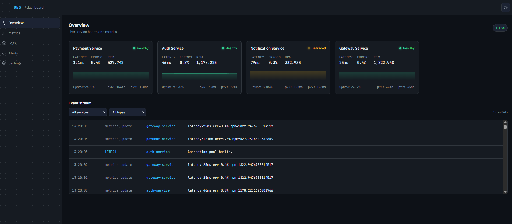
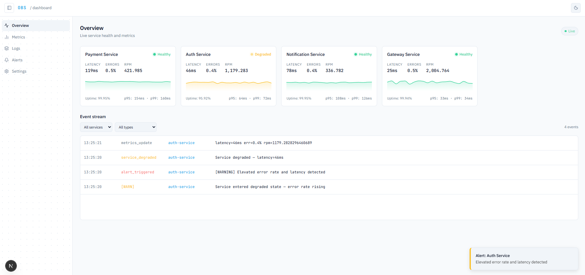
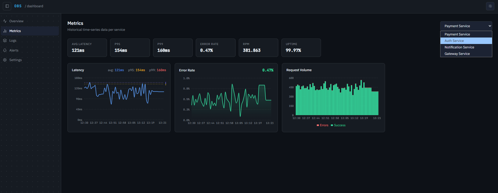
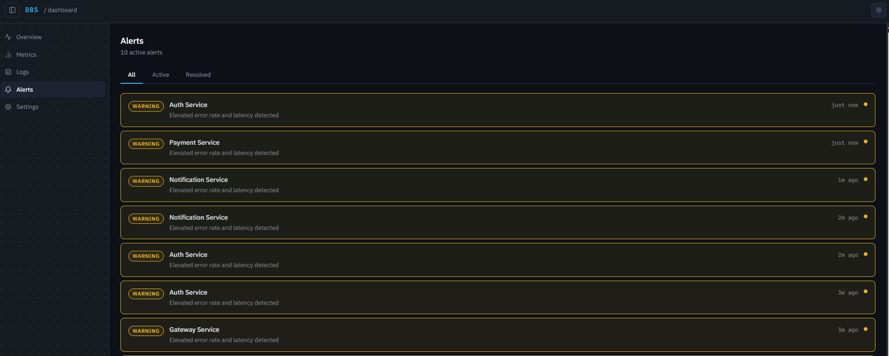
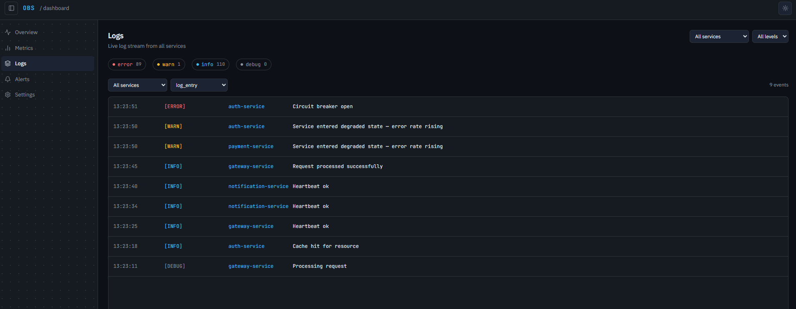
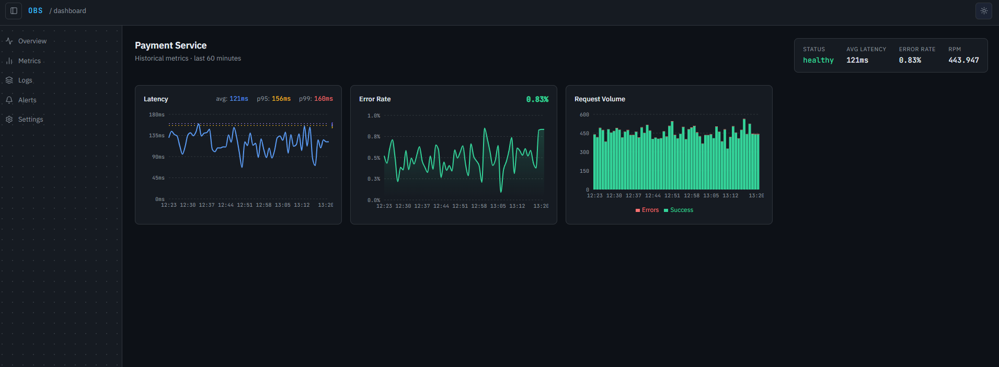
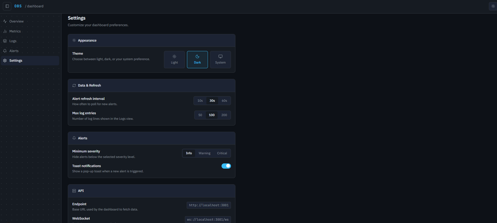

<p align="center">
  
</p>

<h1 align="center">Observability Dashboard</h1>

<p align="center">
  Real-time infrastructure monitoring dashboard with WebSocket streaming, interactive charts, and alert management.
</p>

---

A production-grade observability platform that monitors microservice health in real time. Built as a monorepo (`apps/web` + `apps/mock-api` + `packages/types`), it streams live metrics, logs, and alerts via WebSocket with sub-second latency — no polling required.

## Features

- **Real-time metrics** — Live service health updates streamed over WebSocket, with automatic exponential backoff reconnection (up to 10 retries, 30s max delay)
- **Interactive charts** — Time-series visualizations for latency (avg/p95/p99), error rate, and requests per minute via Recharts
- **Alert lifecycle** — Critical, warning, and info severity levels with triggered/resolved state transitions
- **Log streaming** — Filterable live log feed by service and log level (error, warn, info, debug)
- **Service detail pages** — Per-service drill-down with historical latency and traffic breakdowns
- **Theme support** — Light, dark, and system-adaptive themes with localStorage persistence
- **Settings** — Configurable alert thresholds, polling intervals, log limits, and API endpoints

## Screenshots

### Overview Dashboard

<table>
  <tr>
    <td></td>
    <td></td>
  </tr>
  <tr>
    <td align="center">Dark theme</td>
    <td align="center">Light theme</td>
  </tr>
</table>

### Metrics



### Alerts



### Logs



### Service Detail



### Settings



## Tech Stack

| Layer | Technology |
|---|---|
| Framework | Next.js 16 (App Router) |
| UI | React 19 |
| Server State | TanStack React Query 5 |
| Charts | Recharts 3 |
| Styling | Tailwind CSS 4 |
| Real-time | WebSocket (native API) |
| Icons | Lucide React |
| Notifications | Sonner |
| Build | Turborepo 2 |
| Language | TypeScript 5 (strict) |

## Project Structure

```
apps/web/
├── app/                        # Next.js App Router
│   ├── layout.tsx              # Root layout with theme and toast providers
│   ├── page.tsx                # Overview dashboard
│   ├── metrics/page.tsx        # Historical metrics analytics
│   ├── alerts/page.tsx         # Alert management
│   ├── logs/page.tsx           # Live log streaming
│   ├── settings/page.tsx       # User preferences
│   └── services/[id]/page.tsx  # Per-service detail page
├── components/
│   ├── dashboard/              # Real-time widgets (event feed, service grid)
│   ├── charts/                 # Recharts-based visualizations
│   └── layout/                 # Shell, sidebar, header
├── hooks/
│   ├── use-websocket.ts        # WebSocket connection with retry logic
│   ├── use-services.ts         # Services list (React Query)
│   ├── use-metrics.ts          # Time-series data (React Query)
│   ├── use-alerts.ts           # Alerts with polling (React Query)
│   └── use-logs.ts             # Log entries (React Query)
└── lib/
    └── api.ts                  # Typed fetch wrapper
```

## Getting Started

### Prerequisites

- Node.js ≥ 20
- npm ≥ 10

### Installation

Clone the repository and install dependencies from the monorepo root:

```bash
git clone https://github.com/your-username/observability-dashboard.git
cd observability-dashboard
npm install
```

### Running locally

```bash
npm run dev
```

This starts the full stack via Turborepo:

| Service | URL |
|---|---|
| Web app | http://localhost:3000 |
| Mock API | http://localhost:3001 |

> [!NOTE]
> The mock API simulates four microservices (Payment, Auth, Notification, Gateway) with Gaussian noise, periodic degradation events, and real-time WebSocket broadcasting. No external infrastructure is required.

### Environment variables

Create `apps/web/.env.local` to override the defaults:

| Variable | Default | Description |
|---|---|---|
| `NEXT_PUBLIC_API_URL` | `http://localhost:3001` | REST API base URL |
| `NEXT_PUBLIC_WS_URL` | `ws://localhost:3001` | WebSocket server URL |

## Architecture & Design Decisions

**App Router with React Server Components** — Pages use RSC for layout composition and initial render, while interactive widgets are isolated client components. This keeps the JS bundle minimal and server-rendering fast.

**React Query for server state** — All REST data (services, metrics, alerts, logs) goes through TanStack React Query, giving normalized caching, background refetching, and polling with zero manual state management.

**Custom WebSocket hook** — `use-websocket.ts` implements a connection manager with exponential backoff (initial 1s delay, doubles up to 30s, max 10 attempts) and a 500-event ring buffer. The hook exposes typed `RealtimeEvent` discriminated unions from `packages/types`, so each consumer narrows to exactly the event it needs.

**Shared type contract** — `packages/types` defines all domain types (`ServiceMetrics`, `Alert`, `LogEntry`, `RealtimeEvent`) consumed by both the frontend and the mock API. Breaking API changes fail the TypeScript build across the entire monorepo before any code ships.

**Turborepo task pipeline** — `dev`, `build`, `check-types`, and `lint` are orchestrated with dependency ordering and remote-cache-ready incremental caching, keeping CI fast even as the repo grows.
